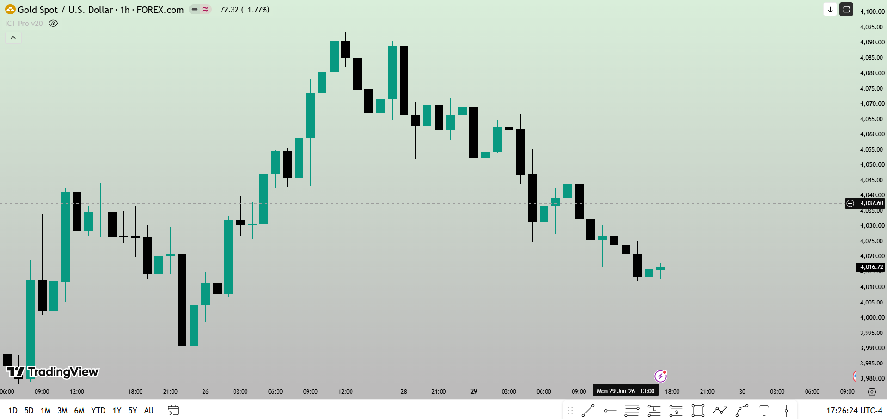
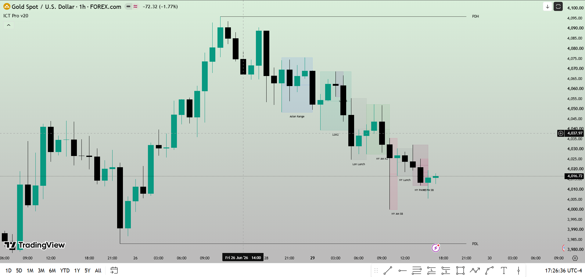
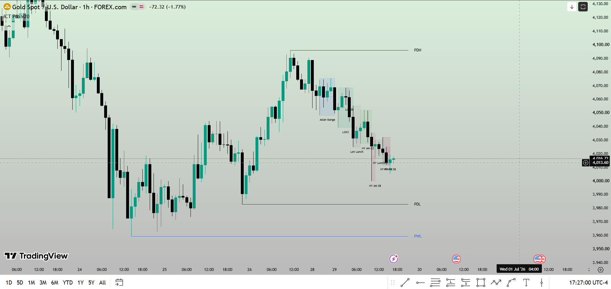
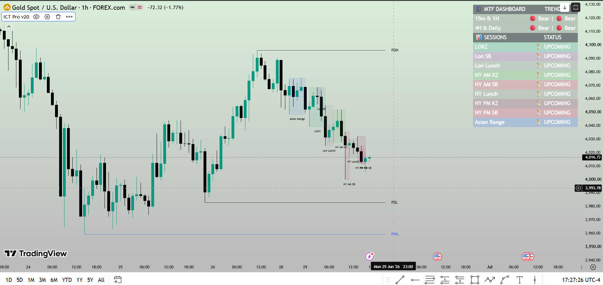
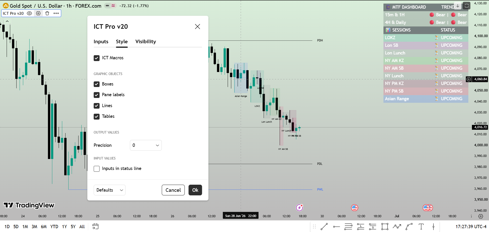
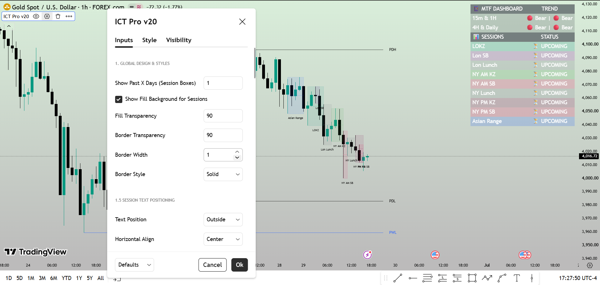
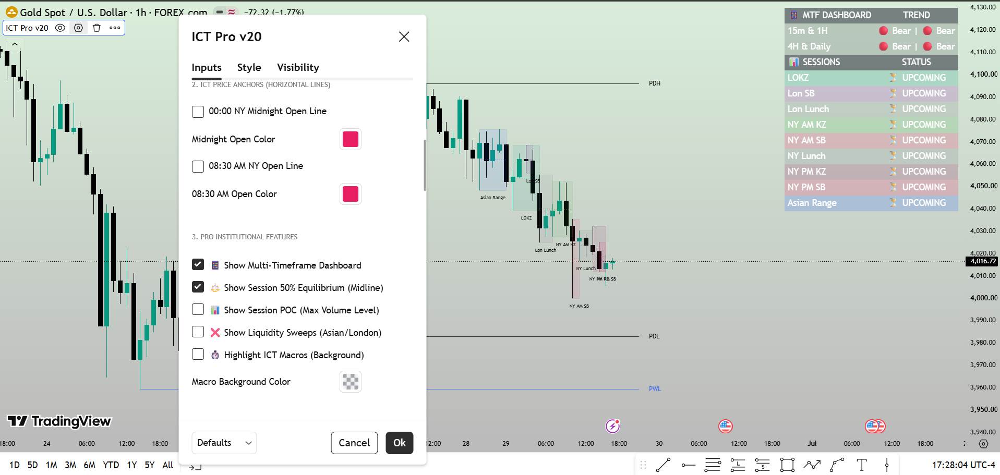
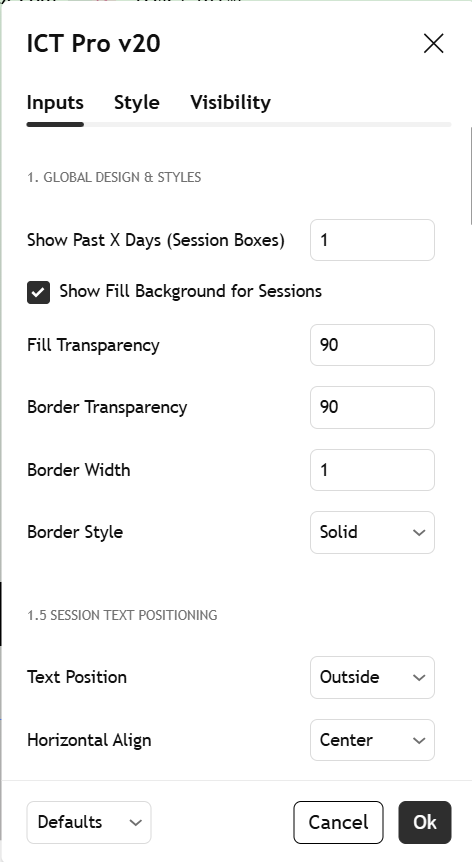

# 📊 Institutional Timing Windows (NY → Local)

An institutional-grade session tracking asset engineered in **Pine Script v6** for TradingView. This technical indicator maps key Smart Money Concepts (SMC) and Inner Circle Trader (ICT) macroeconomic timing windows by dynamically translating New York session times to the user's local terminal chart timezone.

## 🌟 Strategic Features & Algorithms

* **Algorithmic Time-Zone Conversion:** Dynamically calculates exact global epoch timestamps to anchor structural boxes using `timestamp("America/New_York", ...)` equations[cite: 2], ensuring 100% precision across any local broker chart time.
* **Comprehensive Macro Tracking:** Automatically overlays critical algorithmic liquidity periods including[cite: 2]:
  * **Silver Bullet Windows:** AM, PM, and London Killzone blocks[cite: 2].
  * **Killzones:** London Open, NY AM, NY PM, and London Close intervals[cite: 2].
  * **Benchmarks:** Equity Open (9:30 AM NY Line) and Asian Range models[cite: 2].
* **Dynamic Table HUD:** Renders a clean, high-signal, real-time Heads-Up-Display table overlay using `table.new()`[cite: 2], keeping track of active windows and color-coded session priorities directly on the UI[cite: 2].
* **Memory-Optimized Rendering:** Built using vector calculations and native array logic (`array.new_box()`, `array.new_line()`)[cite: 2] to ensure ultra-low execution overhead on TradingView servers[cite: 2].

## 🛠️ Built With
* **Language:** Pine Script v6[cite: 2]
* **Platform:** TradingView[cite: 2]
* **Methodologies:** Smart Money Concepts (SMC), Market Microstructure, Algorithmic Time Architecture
* ## 📸 Indicator Previews & Configuration Settings

🔍 Click here to view all 8 Settings & Chart Previews

### 1. Institutional Timeframes HUD

### 2. Silver Bullet & Killzone Configurations

### 3. Asian Range & Equity Open Overlays

### 4. Table Display Bullish Bearish

### 5. 

### 6. Macro Execution Window Preview

### 7. Custom Color & Opacity Themes

### 8. Historical Session Back-Data View

